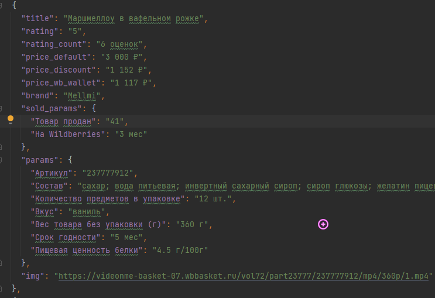

WILDBERRIES Парсер
=====================
У парсера есть 3 функции:
* Парсинг в data.json
* Определение самого популярного слова в data.json
* Чистка data.json от повторений

Все настройки находятся в config.json
Ссылка откуда будет идти парсинг находится там же. В ссылке могут быть любые фильтры, но в ней обязательно должен быть аргумент "page"
Если парсер не нашел не одной страницы - перезапускайте его. В случае если это повторяется - проверьте config.json и убедитесь что ссылка указана правильно
Папку images удалять нельзя. Она требуется для скачивания картинок если это указано в config.json

Вот в таком формате спарсятся данные.
По поводу любых ошибок/предложений/заказов итд - обращайтесь в дискорд angrycat345
